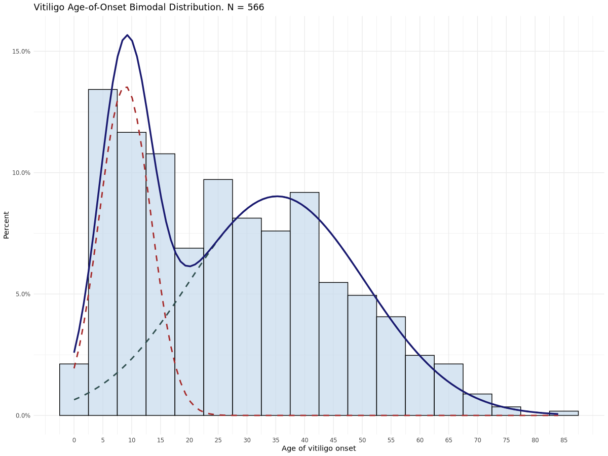

# VOICE Vitiligo Database

Repository for Vitiligo Registry and Bio-Resource (VOICE) Database

## Database Overview

The Vitiligo Registry and Bio-Resource (VOICE) is a prospectively-collected dataset of individuals attending a specialist teriary vitiligo clinic. The dataset captures deep phenotyping information alongside details of treatment, disease impact and Vitiligo Extent Score (VES).[1] Data collection began in June 2020 and is ongoing, with the dataset comprising **585** individuals as of latest data extraction in September 2024.

## Data Cleaning

Data cleaning was performed in Momentum Data's Secure Data Environment (SDE) using R version 4.5.0: Details can be found in [data cleaning pipeline](DataCleaning.md).

## Cohort Profile

### Demographics

The dataset represents a balanced cohort of participants with the following high-level characteristics:

* **Gender Distribution:**
  * 56% Female
  * 44% Male
* **Fitzpatrick Skin Phototype**
  * I - 11
  * II - 60
  * III - 67
  * IV - 101
  * V - 170
  * VI - 76
  * Unknown - 104
* **Baseline Characteristics**
  * Autoimmune Thyroid Disease - 11.62%
  * Atopic Dermatitis - 14.36%
  * Family History of Vitiligo - 29.57%
  * Family History of Autoimmune Thyroid Disease - 25.98%
  * Family History of Atopic Dermatitis - 15.21%

### Age of Vitiligo Onset

Age of onset is self-reported by individuals attending the clinic based on when symptoms of vitiligo first appeared. The distribution of ages aligns closely with that observed by Jin et al.,[2] where distinct haplotypes were found to be associated with early- and late-onset vitiligo. Here we see an early-onset peak at **8.86 years**, and late-onset peak at **35.24 years**.

## References
1. van Geel, N., Lommerts, J., Bekkenk, M., Wolkerstorfer, A., Prinsen, C. A. C., Eleftheriadou, V., Taïeb, A., Picardo, M., Ezzedine, K., & Speeckaert, R. (2016). Development and Validation of the Vitiligo Extent Score (VES): an International Collaborative Initiative. The Journal of Investigative Dermatology, 136(5), 978–984. https://doi.org/10.1016/j.jid.2015.12.040
2. Jin, Y., Roberts, G. H., Ferrara, T. M., Ben, S., van Geel, N., Wolkerstorfer, A., ... & Spritz, R. A. (2019). Early-onset autoimmune vitiligo associated with an enhancer variant haplotype that upregulates class II HLA expression. Nature Communications, 10(1), 391. https://doi.org/10.1038/s41467-019-08337-4
